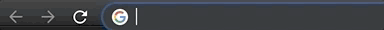
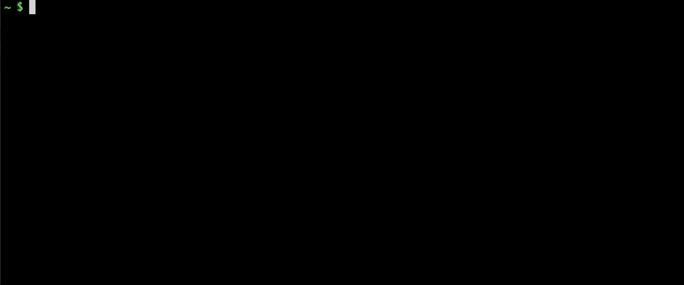

# BestPix

View your best photos by seeing what Apple's machine learning models rate them.
Inspired by Simon Willison's [Pelican post](https://simonwillison.net/2020/May/21/dogsheep-photos/)!

### Description

All of the photos on your iPhone are put through Apple's machine learning models to produce "beautifulness" scores. These scores are stored on your iPhone and can be imported to your MacBook. This package allows you to see the 10 most beautiful photos in your browser.

### Supported Platforms

  * Mac only

### Privacy

No data leaves your computer

# Up and Running

### Installing

1. Download **Docker Desktop** from [docker.com](https://www.docker.com/products/docker-desktop)
   
   To check if you have it, run `docker --version`

   

     **Note**: The exact version might change.

2. Download **Python 3** from [python.org](https://www.python.org/downloads/)
   
   To check if you have it, run `python3 --version`

   

    **Note**: The exact version might change

3. Download **BestPix** by running `pip3 install bestpix`.
   
    

    **Note**: The exact version might change

### Using

1. Import your iPhone's photos to your Mac. Official instructions [here](https://support.apple.com/en-us/HT201302#importmac)
2. To start Docker Desktop, run `open -a Docker`
   
    

3.  To start package, run `reveal`
   
     

4. View the results by opening your web browser and going to the url `localhost:8442`

    

### Uninstalling

1. Open your terminal and run the command `cleanup`, then the command `pip3 uninstall bestpix`
   
2. Uninstall Docker Desktop as you would any Application. Official instructions [here](https://support.apple.com/en-us/HT202235)