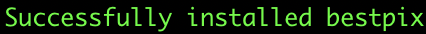

# BestPix

View your best photos by seeing what Apple's machine learning models rate them.
Inspired by Simon Willison's [Pelican post](https://simonwillison.net/2020/May/21/dogsheep-photos/)!

### Description 

All of the photos on your iPhone are put through Apple's machine learning models to produce "beautifulness" scores. These scores are stored on your iPhone and can be imported to your MacBook. This package allows you to see the 10 most beautiful photos in your browser.

### Supported Platforms

  * Mac only 

### Privacy

No data leaves your computer

# Up and Running

### Prerequisites

* `Python3`, which can be installed from [www.python.org](https://www.python.org/downloads/)
    * You're good if running `python3` in your terminal shows 
* `Docker Desktop`, which can be installed from [www.docker.com](https://www.docker.com/products/docker-desktop)

### Install 

1. Open your terminal and run the command `pip3 install bestpix`
    * You're good if you see 

### Use

1. Import your iPhone's photos to your Mac. Official instructions [here](https://support.apple.com/en-us/HT201302#importmac)
2. Start Docker Desktop by opening your terminal and running `open -a Docker`
   * You're good if you see a  in your Menubar
3. Start the package by opening your terminal and running `reveal`
4. View the results by opening your web browser and going to the url `localhost:8442`

### Uninstall 

1. Open your terminal and run the command `cleanup`, then the command `pip3 uninstall bestpix`
2. Shutdown and uninstall Docker Desktop as you would any Application. Official instructions [here](https://support.apple.com/en-us/HT202235)